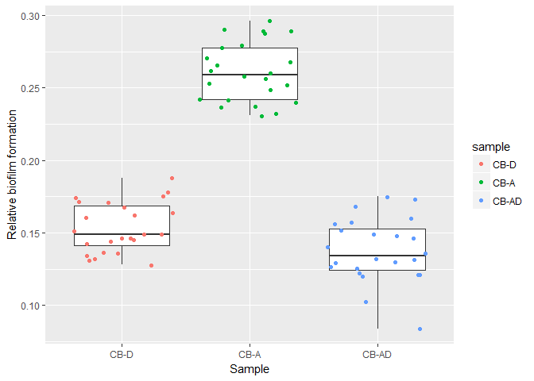

# Task 06 - R Notebook

## Introduction:

This notebook has been created as part of Task 06 for the course GEOL 590. It imports data from a crystal violet biofilm assay (O'Toole, 1998) that was performed on three different strains of *Sulfitobacter* to assess relative biofilm formation. Data was saved as a .csv file for input into R. The first column of data refers to sample number as without these values the data was not able to import properly.

## Results:

The following code was used to create a plot to allow the biofilm data to be visualized:


```r
#Creates a dataframe of the biofilm data called "biofilm" from a .csv file in the data folder
biofilm <- read.csv("../data/biofilm_data.csv", header = TRUE)

#Changes the order of values in the sample factor of the biofilm dataframe
biofilm$sample <- factor(biofilm$sample, levels = c("CB-D", "CB-A", "CB-AD"))

#Loads the ggplot2 package, makes a boxplot of the biofilm data, and then prints the plot
library(ggplot2)

plot <- ggplot(biofilm, aes(sample, value)) +
  geom_boxplot() +
  geom_point(position = "jitter", aes(color = sample)) +
  labs(x = "Sample", y = "Relative biofilm formation")

print(plot)
```

<!-- -->

```r
#Creates subsets of dataset by sample so that in line code in table below can take average values
D <- biofilm[biofilm$sample == "CB-D", ]
A <- biofilm[biofilm$sample == "CB-A", ]
AD <- biofilm[biofilm$sample == "CB-AD", ]
```

Averages of each sample are may be found in the table below:

*Sulfitobacter* sp. | Average of relative biofilm formation
--------------------|---------------------------------------
CB-D                | 0.153375
CB-A                | 0.2608333
CB-AD               | 0.1376667

## Discussion:

The above plot shows that *Sulfitobacter* sp. CB-A forms more biofilm than strains CB-D and CB-AD when grown under the same conditons.

## References:

1. O'TOOLE, G. A. & KOLTER, R. 1998. Initiation of biofilm formation in Pseudomonas fluorescens WCS365 proceeds via multiple, convergent signalling pathways: a genetic analysis. Molecular Microbiology, 28, 449-461.
