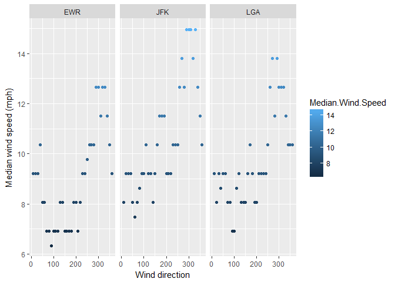

# Task 07 - R Notebook

##Introduction

This R Markdown Notebook has been created for as part of Task 06 for the course GEOL 590. This task is an introduction to using the **dplyr** package with the built-in datasets **nycflights13** and **babynames**.

##Assigned tasks

* Using the `nycflights13::weather`:
    * Determine whether there are any clear outliers in wind speed (`wind_speed`) that should be rejected. If so, filter those bad point(s) and proceed.
    * What direction has the highest median speed at each airport? Make a table and a plot of median wind speed by direction, for each airport. *Optional fun challenge: If you like, this is a rare opportunity to make use of `coord_polar()`.*
    

```r
library(tidyverse) #Loads the packages associated with the tidyverse
```

```
## Loading tidyverse: ggplot2
## Loading tidyverse: tibble
## Loading tidyverse: tidyr
## Loading tidyverse: readr
## Loading tidyverse: purrr
## Loading tidyverse: dplyr
```

```
## Conflicts with tidy packages ----------------------------------------------
```

```
## filter(): dplyr, stats
## lag():    dplyr, stats
```

```r
library(nycflights13) #Loads the nycflights dataset

#Calculates median wind speed of data by airport and direction for use in table and plot
median_wind_speed <- weather %>%
  group_by(origin, wind_dir) %>%
  select(origin, wind_dir, wind_speed) %>%
  #Filters out large outlier in wind speed as well as data for which there is no wind direction specified
  filter(wind_speed < 50, wind_dir != "NA", wind_dir != "0") %>%
  summarise(Median.Wind.Speed = median(wind_speed, na.rm = TRUE)) %>%
  rename(Wind.Direction = wind_dir, Origin = origin)


library(DT) #Loads the DT package which provides an R interface for the JavaScript library DataTables

#Creates a datatable of median wind speed data using the DT package
datatable(median_wind_speed, class = "cell-border stripe", colnames = c("Airport", "Wind Direction", "Median Wind Speed (mph)"))
```

<!--html_preserve--><div id="htmlwidget-d95defdeafdf08265de8" style="width:100%;height:auto;" class="datatables html-widget"></div>
<script type="application/json" data-for="htmlwidget-d95defdeafdf08265de8">{"x":{"filter":"none","data":[["1","2","3","4","5","6","7","8","9","10","11","12","13","14","15","16","17","18","19","20","21","22","23","24","25","26","27","28","29","30","31","32","33","34","35","36","37","38","39","40","41","42","43","44","45","46","47","48","49","50","51","52","53","54","55","56","57","58","59","60","61","62","63","64","65","66","67","68","69","70","71","72","73","74","75","76","77","78","79","80","81","82","83","84","85","86","87","88","89","90","91","92","93","94","95","96","97","98","99","100","101","102","103","104","105","106","107","108"],["EWR","EWR","EWR","EWR","EWR","EWR","EWR","EWR","EWR","EWR","EWR","EWR","EWR","EWR","EWR","EWR","EWR","EWR","EWR","EWR","EWR","EWR","EWR","EWR","EWR","EWR","EWR","EWR","EWR","EWR","EWR","EWR","EWR","EWR","EWR","EWR","JFK","JFK","JFK","JFK","JFK","JFK","JFK","JFK","JFK","JFK","JFK","JFK","JFK","JFK","JFK","JFK","JFK","JFK","JFK","JFK","JFK","JFK","JFK","JFK","JFK","JFK","JFK","JFK","JFK","JFK","JFK","JFK","JFK","JFK","JFK","JFK","LGA","LGA","LGA","LGA","LGA","LGA","LGA","LGA","LGA","LGA","LGA","LGA","LGA","LGA","LGA","LGA","LGA","LGA","LGA","LGA","LGA","LGA","LGA","LGA","LGA","LGA","LGA","LGA","LGA","LGA","LGA","LGA","LGA","LGA","LGA","LGA"],[10,20,30,40,50,60,70,80,90,100,110,120,130,140,150,160,170,180,190,200,210,220,230,240,250,260,270,280,290,300,310,320,330,340,350,360,10,20,30,40,50,60,70,80,90,100,110,120,130,140,150,160,170,180,190,200,210,220,230,240,250,260,270,280,290,300,310,320,330,340,350,360,10,20,30,40,50,60,70,80,90,100,110,120,130,140,150,160,170,180,190,200,210,220,230,240,250,260,270,280,290,300,310,320,330,340,350,360],[9.20624,9.20624,9.20624,10.35702,8.05546,8.05546,6.90468,6.90468,6.32929,6.90468,6.90468,6.90468,8.05546,8.05546,6.90468,6.90468,6.90468,6.90468,8.05546,8.05546,6.90468,8.05546,9.20624,9.20624,9.78163,10.35702,10.35702,10.35702,12.65858,12.65858,11.5078,12.65858,12.65858,11.5078,10.35702,9.20624,8.05546,9.20624,9.20624,9.20624,8.05546,7.48007,8.05546,8.63085,9.20624,9.20624,10.35702,9.20624,9.20624,8.05546,9.20624,10.35702,11.5078,11.5078,11.5078,9.20624,9.20624,9.20624,10.35702,10.35702,10.35702,12.65858,13.80936,12.65858,14.96014,14.96014,14.96014,13.80936,14.96014,12.65858,11.5078,10.35702,9.20624,8.05546,9.20624,8.63085,9.20624,9.20624,8.05546,8.05546,6.90468,6.90468,8.63085,9.20624,8.05546,8.05546,8.05546,9.20624,10.35702,9.20624,8.05546,8.05546,9.20624,9.20624,9.20624,9.20624,10.35702,12.65858,13.80936,11.5078,13.80936,12.65858,12.65858,12.65858,11.5078,10.35702,10.35702,10.35702]],"container":"<table class=\"cell-border stripe\">\n  <thead>\n    <tr>\n      <th> \u003c/th>\n      <th>Airport\u003c/th>\n      <th>Wind Direction\u003c/th>\n      <th>Median Wind Speed (mph)\u003c/th>\n    \u003c/tr>\n  \u003c/thead>\n\u003c/table>","options":{"columnDefs":[{"className":"dt-right","targets":[2,3]},{"orderable":false,"targets":0}],"order":[],"autoWidth":false,"orderClasses":false}},"evals":[],"jsHooks":[]}</script><!--/html_preserve-->

```r
#Makes a plots of median wind speed as a function of wind direction by airport
wind_speed_plot <- ggplot(median_wind_speed, aes(Wind.Direction, Median.Wind.Speed, color = Median.Wind.Speed)) +
  geom_point() +
  facet_wrap(~Origin) +
  labs(x = "Wind direction", y = "Median wind speed (mph)")

print(wind_speed_plot)
```

<!-- -->

* Using `nycflights13::flights` and `nycflights13::airlines`:
    * Make a table with two columns: airline name (not carrier code) and median distance flown from JFK airport. The table should be arranged in order of decreasing mean flight distance. Hint: use a `_join` function to join `flights` and `airlines`.
    


* Make a *wide-format* data frame that displays the number of flights that leave Newark ("EWR") airport each month, from each airline


* Using the **babynames** dataset:
    * Identify the ten most common male and female names in 2014. Make a plot of their frequency (`prop`) since 1880. (This may require two separate piped statements). 
    * Make a single table of the 26th through 29th most common girls names in the year 1896, 1942, and 2016


* Write task that involves some of the functions on the Data Wrangling Cheat Sheet and execute it. You may either use your own data or data packages (e.g., the ones listed [here](https://blog.rstudio.org/2014/07/23/new-data-packages/)).


##Optional challenge

Using regular expressions, make a plot of the change in frequency of some letter pattern in names. For instance: how has the frequency of female names ending in "leigh" changed over time relative to names ending in "lee"?


